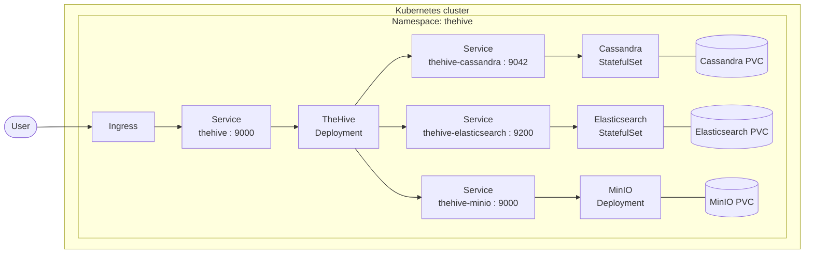
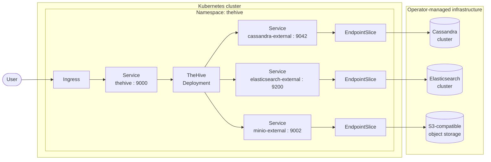
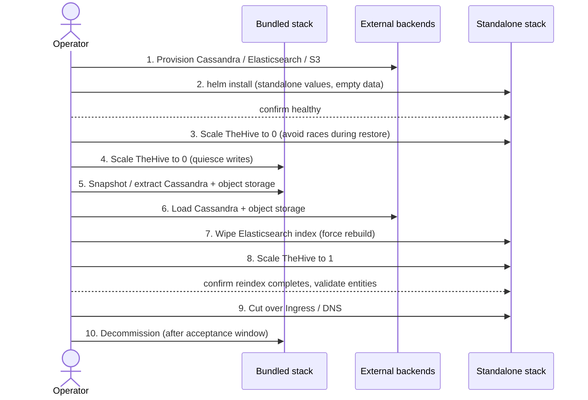

# Migrating from bundled to standalone mode

This document is for operators currently running TheHive via this chart in
**bundled mode** (Cassandra, Elasticsearch and MinIO deployed as Helm
subcharts inside the same release) and who want to move to **standalone
mode** (the same chart, with the three backends provided externally).

It explains the motivation, the architectural difference, and the
high-level migration sequence. The detailed procedure (commands,
verification, rollback) is intentionally out of scope for this overview —
it will live in sibling documents under `scenarios/migration/` as the
runbooks are stabilised.

## Motivation

Bundled mode is a quick-start: one `helm install` deploys TheHive *and*
its stateful infrastructure. It is well suited to demos, evaluation
clusters and self-contained CI environments.

It is **not** intended for production loads.

## Bundled vs standalone

| Concern                  | Bundled mode                                                        | Standalone mode                                                                                                                |
|--------------------------|---------------------------------------------------------------------|--------------------------------------------------------------------------------------------------------------------------------|
| Cassandra                | Bitnami `cassandra` subchart (StatefulSet)                          | Operator-provided cluster (any reachable Cassandra 4.x)                                                                        |
| Elasticsearch            | Bitnami `elasticsearch` subchart (StatefulSet)                      | Operator-provided cluster (any reachable Elasticsearch 8.x+)                                                                   |
| Object storage           | MinIO community subchart (Deployment)                               | Any S3-compatible endpoint (MinIO, AWS S3, GCS, SeaweedFS, etc.)                                                                          |
| Persistent volumes       | Created by the subcharts in-cluster                                 | Owned by the external backend, outside the chart's scope                                                                       |
| Backup / DR              | Operator's responsibility                   | Operator's responsibility                                                            |
| Backend network exposure | Subchart-created `Service` per backend                              | Operator-created `Service` + `EndpointSlice` per backend                                                                       |
| Chart values toggles     | `cassandra.enabled / elasticsearch.enabled / minio.enabled` all `true` | All three set to `false`; `thehive.{database,index,storage}.hostnames` / `endpoint` point at the operator-provided services |

See [`scenarios/standalone/`](../standalone/) for the target-side
configuration: the `values.yaml` overlay to apply, and the
`k8s-endpoints-template.yaml` that wires in-cluster Services to backends
running outside the cluster.

## Architecture: bundled mode (current)

In bundled mode the chart owns everything inside the Kubernetes
namespace. TheHive talks to its three backends via the Services that the
subcharts create. All persistence is on PVCs provisioned by the cluster's
default StorageClass.

Everything inside the `Kubernetes cluster` boundary is created and
updated by `helm install`/`helm upgrade` on this chart.

## Architecture: standalone mode (target)

In standalone mode the chart owns only the TheHive application. The
three backends live wherever the operator chooses — another Kubernetes
namespace, a different cluster, a VM fleet, or a managed cloud service.

The chart still talks to its backends by `Service` name; the **operator**
creates those Services + `EndpointSlice` objects so that
`cassandra-external`, `elasticsearch-external` and `minio-external`
resolve to the real backend endpoints.

The chart's render is now strictly an application deployment: one
Deployment, one Service, one Ingress, and the supporting
ConfigMap / Secret / ServiceAccount / Role objects. PVCs disappear from
the chart's footprint entirely.

## Migration sequence (high level)

The recommended path is a **cold migration with side-by-side stacks**:

1. Provision the external backends *before* touching the bundled stack.
   Verify connectivity from inside the target Kubernetes cluster (a
   throw-away pod with `curl` / `cqlsh` / `mc` is enough).
2. Install the chart a second time in a separate namespace, in
   standalone mode, pointing at the new backends. Confirm it comes up
   healthy with empty data.
3. Schedule a maintenance window. Stop writes to the bundled stack by
   scaling its TheHive Deployment to zero. Stop writes to the new stack
   the same way so that the restore is not racing the application.
4. Move data from the bundled backends to the external ones. Cassandra
   is the primary source of truth for case/alert/observable state.
   Object storage carries attachment content. Elasticsearch is a
   derived secondary index — it can be rebuilt from Cassandra on first
   start of the target TheHive, which avoids the work of migrating it
   directly.
5. Bring the standalone TheHive back up. Watch the logs for the
   schema-walk / reindex pass to complete. Verify entities and
   attachments are queryable.
6. Cut traffic over (DNS / Ingress) once acceptance criteria pass.
   Decommission the bundled stack after an agreed retention window.

The exact commands for each step depend on the operator's choice of
data-movement strategy — filesystem copy vs application-level export,
hot vs cold, with or without an Elasticsearch backup. Those choices are
covered in the next document.
